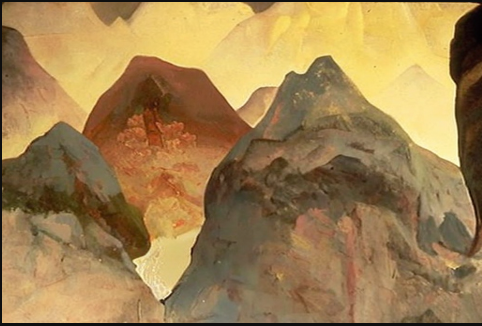
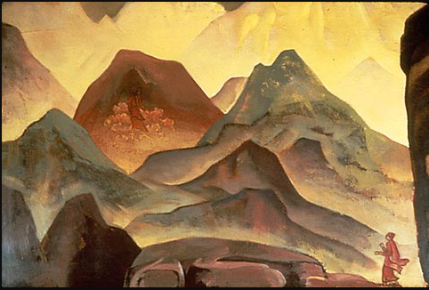

# 🔧 Computer Vision Project - Group 6

## Class: LA01
**Course:** 🌐 Computer Vision  
**University:** 🎓 Bina Nusantara University  
**Major:** 💻 Computer Science 🎓    

## 🔰 Group Members
- **2602058932** - Jovan Amarta Liem  
- **2602070351** - Jonathan Surya Sanjaya  
- **2602178911** - Cecillia Tjung  

## 🕹️ Overview
We created this project to solve the problem of using artificial intelligence (AI) in art, especially art that produced by AI. AI provides many benefits, but if its uncontrolled, it can cause problems such as plagiarism, pirating, and economic loss for the original artist who created the art. 

We create a solution to the problem by building AI models that can detect whether the art or the image is an AI generated image. To create the models, we took the datasets from:
- https://www.kaggle.com/datasets/ravidussilva/real-ai-art
- https://www.kaggle.com/datasets/danielmao2019/deepfakeart

The models that we created consists of 5 models, 3 deep learning models, and 2 machine learning models with different feature extraction method. Here are the models that we created: 
- ResNet50V2
- Xception
- ViT (Google / ViT - base - patch16 - 224)
- XGBoost with HSV
- Random Forest with HSV
- XGBoost with HSV + Edge Detection
- Random Forest with HSV + Edge Detection
- XGBoost with MPEG7
- Random Forest with MPEG7

## 🖼️ Dataset Samples

### AI-Generated Art


### Human-Created Art


# Experiment Results

## Previous Experiments
| **Model**               | **Total Images** | **Accuracy** |
|-------------------------|------------------|--------------|
| **XGB + HSV**           | 18000 images     | 62.25%       |
| **XGB + HSV + Edge**    | 18000 images     | 63.89%       |
| **XGB + MPEG7**         | 3600 images      | 64.17%       |
| **RF + HSV**            | 18000 images     | 60.75%       |
| **RF + HSV + Edge**     | 18000 images     | 62.36%       |
| **RF + MPEG7**          | 3600 images      | 58.47%       |
| **Xception**            | 18000 images     | 72.16%       |
| **ResNet**              | 18000 images     | 72.80%       |
| **ViT (Vision Transformer)** | 18000 images | 80.80%       |

## Latest
| **Model**               | **Total Images** | **Accuracy** |
|--------------------------|------------------|--------------|
| **XGB + HSV**           | 940 images       | 89,36%       |
| **XGB + HSV + Edge**    | 940 images       | 88,30%       |
| **XGB + MPEG7**         | 940 images       | 87,23%       |
| **RF + HSV**            | 940 images       | 89,36%       |
| **RF + HSV + Edge**     | 940 images       | 88,30%       |
| **RF + MPEG7**          | 940 images       | 74,47%       |
| **Xception**            | 3660 images      | 81%          |
| **ResNet**              | 3660 images      | 75%          |
| **ViT (Vision Transformer)** | 3660 images      | 81,14%       |
---


# 💻 Installation Guide 

## 🏠 Local Setup
1. 🐍 Ensure you have **Python 3.10** installed on your system.  
   👉 [Download Python here](https://www.python.org/downloads/) if needed.  

2. 📥 Clone this repository to your local machine:  
   ```bash
   git clone https://github.com/JonathanSuryaS/AI-Art-Detection-
3. Install the required using the following commands:
pip install -r requirements.txt
4. Download the model from the given link here https://github.com/JonathanSuryaS/AI-Art-Detection-/tree/main/Model or visit https://github.com/JonathanSuryaS/AI-Art-Detection-/blob/main/Model/DownloadModelTutorial.ipynb to directly implement model on your Jupyter Notebook.
5. Ensure the path in app.py is fixed following your system.
6. Run the Application with the following commands:
run python app.py / run python3 app.py according to your system in your terminal  or command prompt.

## Gradio